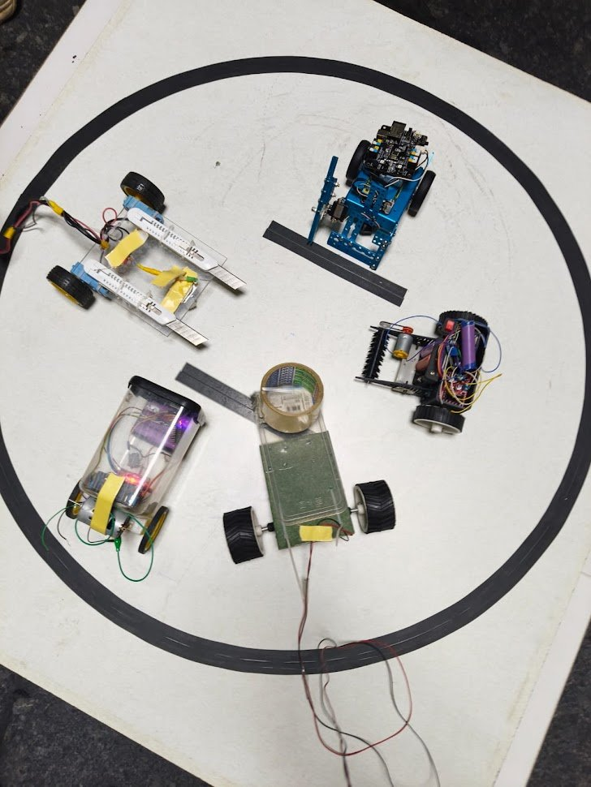
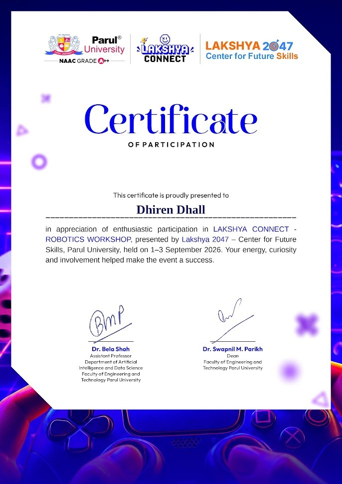
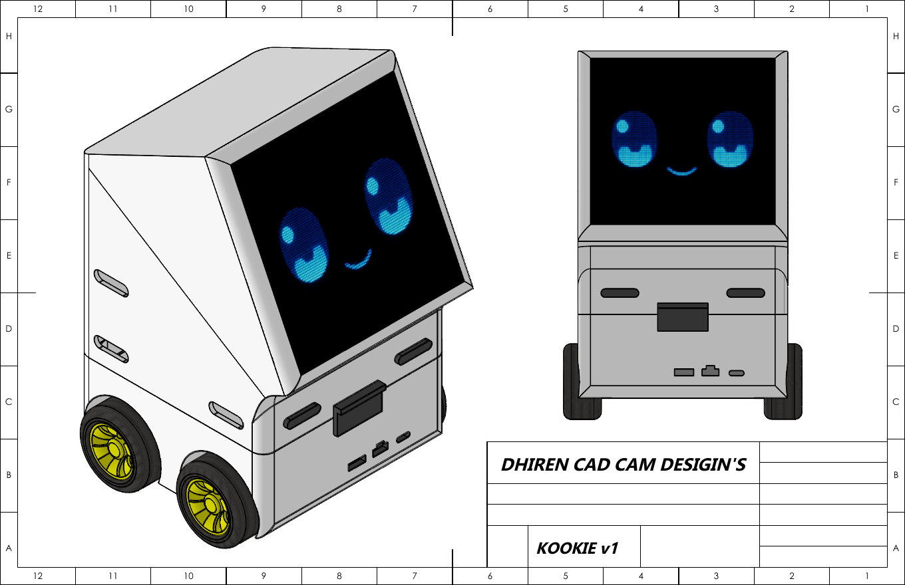
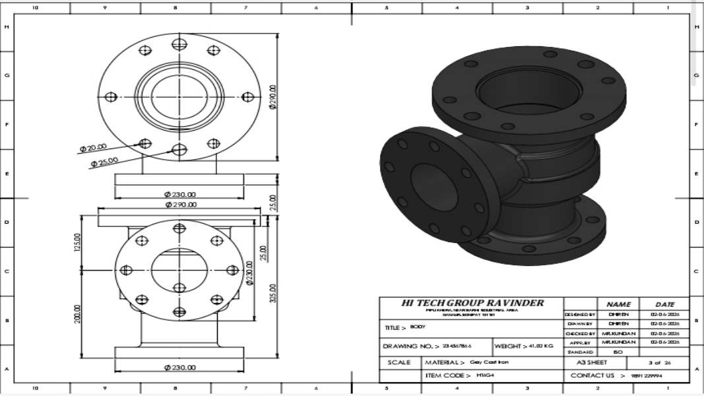
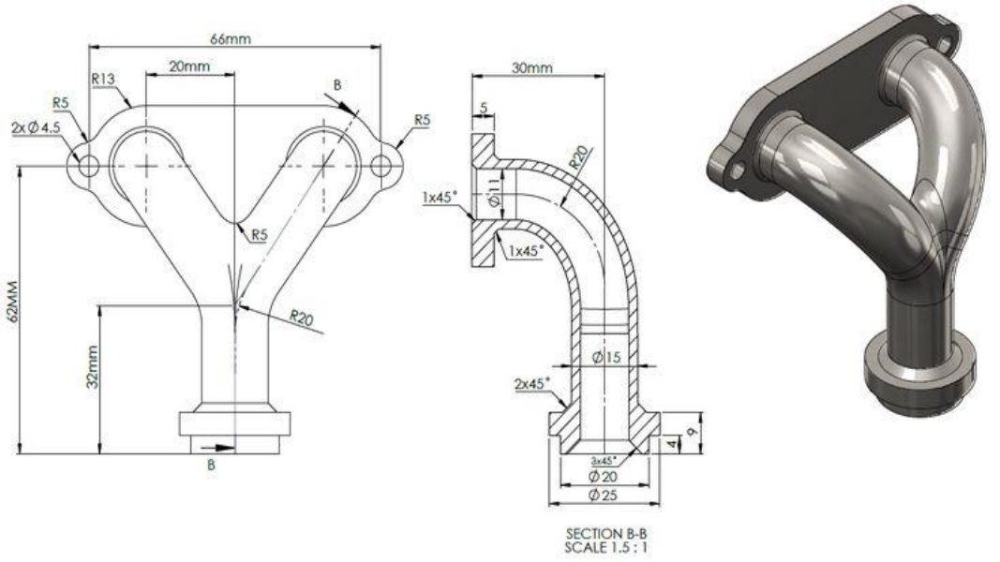
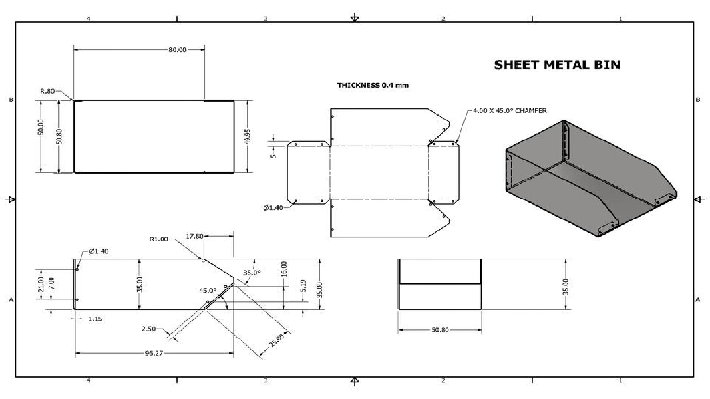
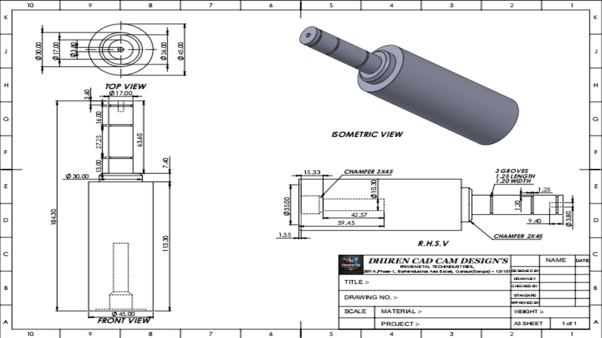
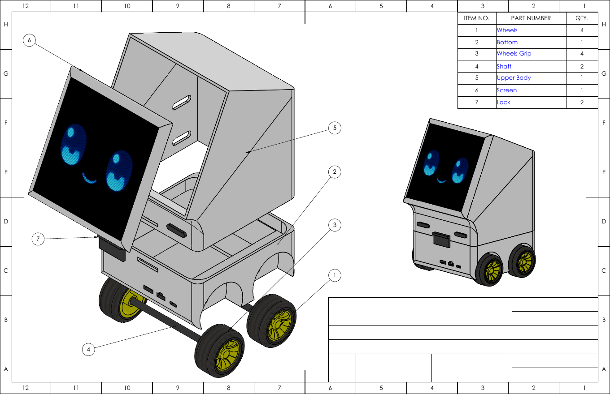
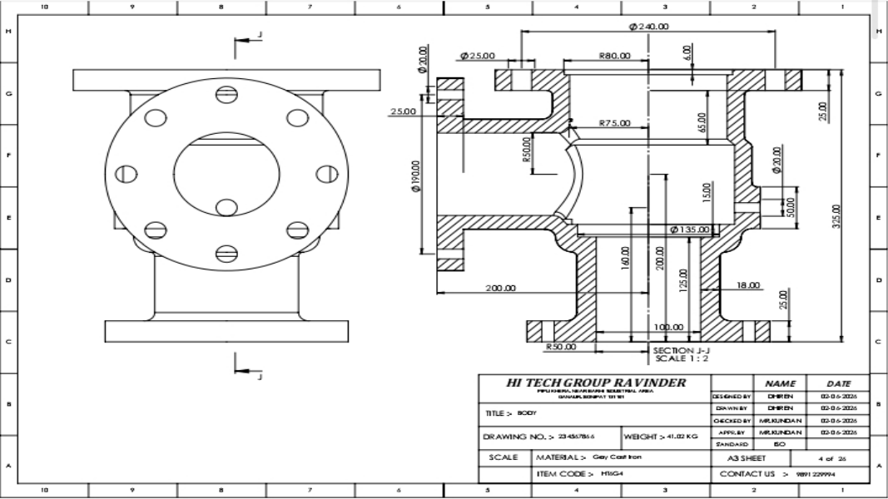

<div align="center">




<br/>


</div>
                                            <a href="https://themecharonin.github.io/TheMechaRonin/">
  
</a>


## 🥷 whoami

```json
{
  "name": "Dhiren Dhall",
  "alias": "The Mecha Ronin",
  "role": "Mechatronics Student | CAD/CAM Designer | Robotics Builder | Video Editor",
  "education": "Diploma in Mechatronics, 1st Year — Parul University",
  "company": "Founder, MechaFusion Technologies",
  "location": "Vadodara, Gujarat, India",
  "achievement": "🥈 2nd Place — Robo Fight",
  "tagline": "Code • Design • Build • Automate",
  "status": "Open for CAD design & video editing work"
}
```

<div align="center"></div>

## 💼 Services — Work With Me

> Need a design, a video or a prototype? **I take real work.** Message me and let's build it.

<table>
<tr>
<td width="50%" valign="top">

### 🎬 Video & Photo Editing
- Reels / short videos
- YouTube-style video edits
- Event, college and promo videos
- Photo editing and posters

**Tools of the trade:** video & photo editing software, clean cuts, good pacing.

</td>
<td width="50%" valign="top">

### 📐 CAD / CAM Design
- 2D drafting in **AutoCAD**
- 3D part and assembly modeling in **SolidWorks**
- Engineering drawings with dimensions and BOM
- Pipeline, valve, gear and sheet-metal designs

**Software:** SolidWorks • AutoCAD • Fusion 360 • Solid Edge

</td>
</tr>
<tr>
<td colspan="2" align="center">

### 🔌 Also: PCB Design & Arduino-based prototype help

</td>
</tr>
</table>

<div align="center">


[](mailto:dhirendhall919@gmail.com)


</div>

<div align="center"></div>

## ⚙️ About Me

- 🎓 Diploma **Mechatronics** student (1st year) at **Parul University**, Vadodara
- 🏢 Founder of **MechaFusion Technologies** *(website coming soon)*
- 📐 Designing in **SolidWorks, AutoCAD, Fusion 360 and Solid Edge** — from single parts to big assemblies
- 🤖 Building Arduino robots: line following, obstacle avoiding, Bluetooth-controlled cars
- 🥈 Finished **2nd** in a **Robo Fight** competition
- 🔧 Hands-on workshop skills: welding (Arc / MIG / TIG), lathe, grinding, basic milling
- 🧠 Code is written with **AI assistance** while I keep learning Arduino C++ and Python
- 🎬 I also do **video and photo editing**

<div align="center"></div>

## 🏆 Achievements

### 🥈 Robo Fight — 2nd Place
Took part in a robot fight competition and finished **runner-up (2nd place)**.

<div align="center">
  
  <br/><sub>The Robo Fight arena</sub>
</div>

### 🎓 Robotics Workshop — Completed
**LAKSHYA CONNECT – Robotics Workshop**, presented by **Lakshya 2047 – Center for Future Skills, Parul University** (1–3 September 2026). Completed the full workshop and received the **Certificate of Participation**.

<div align="center">
  
</div>

<div align="center"></div>

## 🛠️ Tech Stack

### CAD / Design


### Electronics & Coding


### Fabrication & Creative


<div align="center"></div>

## 🚀 Featured Projects

<table>
<tr>
<td width="50%" valign="top" align="center">

### 🤖 KOOKIE v1
**Friendly service robot — designed in SolidWorks**



Compact 4-wheel robot with an **LED screen face** (animated eyes and smile). Upper body opens for access, screen is held by locks. Full part drawings with dimensions.


</td>
<td width="50%" valign="top" align="center">

### 🔧 Industrial Valve Design
**Check valves & pipeline assemblies**



Reducing check valve, feed check valve, screw-down valve and more. Gray cast iron body, flanged pipeline design, section drawings with BOM.


</td>
</tr>
<tr>
<td width="50%" valign="top" align="center">

### 🏎️ Arduino Smart Car
**Line following • Obstacle avoiding • Bluetooth**

Arduino UNO based car that follows a line, avoids obstacles with an ultrasonic sensor, and can be driven from a phone over Bluetooth.


*📸 Photos and video coming soon*

</td>
<td width="50%" valign="top" align="center">

### 🕳️ Pipeline Defect Detection Robot
**Goes inside pipes and finds the defects**

A robot concept that travels inside a pipe and locates where the defects are, mixing mechanical design, robotics and problem-solving.


*📸 Photos and video coming soon*

</td>
</tr>
</table>

### 📐 More CAD Work

<div align="center">
  
  
  
  <br/>
  
  
</div>

<div align="center"></div>

## 🧭 My Journey So Far

| Milestone | What I did |
|-----------|------------|
| 🚗 **Arduino Smart Car** | Line following, obstacle avoiding and Bluetooth control |
| 🕳️ **Pipeline Robot** | Designed a robot concept to find defects inside pipes |
| 🥈 **Robo Fight** | Competed and finished **2nd place** |
| 🎓 **Robotics Workshop** | Completed Lakshya Connect workshop, Parul University (Sep 2026) |
| 🤖 **Kookie v1** | Designed a full robot in SolidWorks with drawings for every part |
| 🏢 **MechaFusion Technologies** | Started my own company *(website coming soon)* |

<div align="center"></div>

## 🚧 Currently Working On

- 📚 Getting better at **Arduino C++ and Python**
- 🧩 Learning more **Fusion 360** and **PCB design**
- 🌐 Building the **MechaFusion Technologies** website
- 🤖 Goal: take **Kookie** from CAD design to a working robot

<!--
## 📊 GitHub Stats  (remove this comment tag after you have a few repos)
<div align="center">
  
  
</div>
-->

<div align="center"></div>

## 🤝 Let's Connect

<div align="center">

**Want a video edited, a part designed or a robot built? Message me.**


[](mailto:dhirendhall919@gmail.com)
[](https://github.com/TheMechaRonin)


</div>
